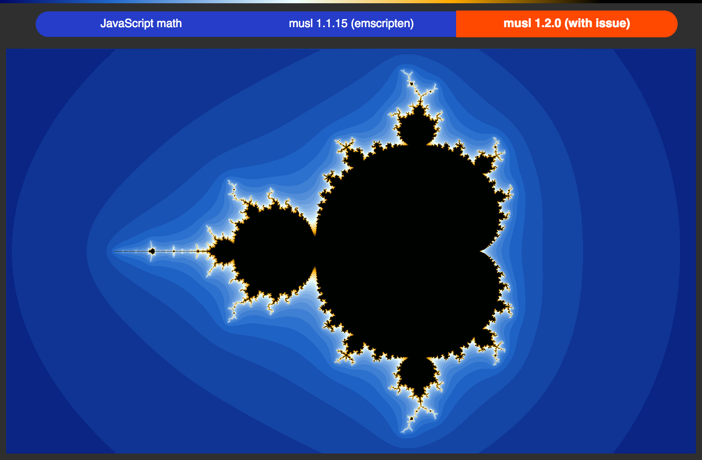

# Mandelbrot set demo
Visually demonstrate some precision lost in **log(x)** / **log2(x)** math functions introduced in **libmusl 1.2.0**.

Perhaps other functions like **exp(x)** and **pow(x, y)** also affcted due to similar approach which uses lookup tables.

This demo uses different math functions from Javascript, standard math lib of emscripten (musl 1.1.15) and latest musl 1.2.0 which partially inctuded (only log and log2 math functions).

## [Live Demo](https://maxgraey.github.io/mandelbrot-issue-demo)



## Build Requirements

- emscripten 1.38.44 or later
- node.js v8.0.0 or later

## Build from C++ sources

```sh
npm run build
```
